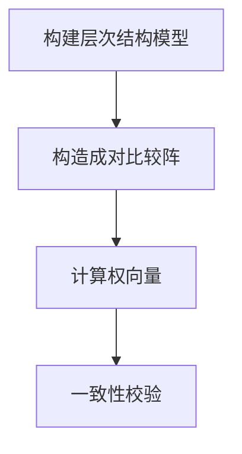

# AHP (The analytic hierarchy process) - 层次分析法

关键词： 层次分析法，层级分析法，AHP，综合评价，主观评价

[TOC]

## 0.  前言

目前看到的层次分析法虽然有很多讲的都很不错很详细，但是感觉版本都比较老旧了，而且图片也引用的各种地方的，样式不是很统一。

另一方面，在我所查阅到的中文的参考资料中，一致性检验和计算权重部分都合在一起，感觉如果之前没有了解过的理解起来会有一定的影响，所以参考一些资料[^3]把一致性检验放在最后，希望可以换一个方向来描述，让思路受阻的朋友可以多一份参考。

所以在此整理一下，希望能有所贡献。

## 1. 目标

简单总结在宏观上说了一下AHP要解决的问题是什么，详细描述给出了几个具体的情景。

### 1.1 简单总结

简单来说，层次分析法解决的问题是，如果有多个指标需要综合评价，但是无法直接给出各自的权重。所以换一种方法，通过给定两两之间的重要程度的关系来计算出各自最后的权重。

----

### 1.2 详细描述

> 以下详细的问题描述来源[^1]

日常生活中有很多的决策问题。决策是指在面临多种方案时需要依据一定的标准选择某一种方案。日常生活中有许多决策的问题。比如：

1. 买钢笔，一般要依据质量、颜色、实用性、价格、外形等方面的因素选择某一支钢笔。
2. 假期旅游，是去风光秀丽的苏州，还是去迷人的北戴河，或者是去山水甲天下的桂林，那一般会依据景色、费用、食宿条件、旅途等因素来算着去哪个地方。

面临各种各样的方案，要进行比较、判断、评价、直至最后的决策。这个过程中都是一些主观的因素，这些因素可能由于个人情况的不同，有相应不同的比重，所以这样主观因素给数学方法的解决带来了很多的不便

---

## 2. 背景

由20世纪70年代由美国运筹学家托马斯·塞蒂（T.L.saaty）正式提出[^2][^3]

---

## 3. 步骤

### 3.1 构建层次模型

#### 3.1.1 层次模型的构成

要构建层次模型其实是指要把各个部分之间的关系理清楚，比如要评价的事物都有哪些基本的指标？这些基本的指标对于一些更加抽象的指标的影响的关系是怎样的？最高层次的指标是如何影响最后评价的分数的？

大部分资料都提到层次模型一共有三层：

		1. 目标层
  		2. 准则层
  		3. 方案层

以下将详细的介绍各个部分的意义

##### 3.1.1.1 目标层

目标层是指在这次评价模型中要评价的物品是什么

> 感觉没啥用…就是挂个名字，比如要评价一个苹果好不好，那苹果的好坏就是目标层

##### 3.1.1.2 准则层

准则层是在评价过程中的各种指标或者说影响判断的因素。如果依然拿苹果好坏的例子来说，那么苹果的新鲜程度、甜度等等都是在准则层中。

需要注意的一点是准侧层不一定是单层的，有一些低级指标可能会对高级指标产生影响。比如苹果的销量和价格以及口味相关。而口味又和香甜和新鲜相关呈正相关；价格与香甜和新鲜呈负相关。

##### 3.1.1.3 方案层

方案层

##### 3.1.1.4 总结+吐槽

但是在算法的构建过程中都是在准则层进行运算的，目标层和方案层反而没什么用处。（P.S. 吐槽一下准则层这个名字估计是直接从 hierarchy 翻译过来的…)

[^1]: [层次分析法(AHP)-知乎专栏-触摸壹缕阳光](https://zhuanlan.zhihu.com/p/39993228) 
[^2]: [层次分析法-智库·百科]([https://wiki.mbalib.com/wiki/%E5%B1%82%E6%AC%A1%E5%88%86%E6%9E%90%E6%B3%95](https://wiki.mbalib.com/wiki/层次分析法))
[^3]: [The Analytic Hierarchy Process](https://www3.diism.unisi.it/~mocenni/Note_AHP.pdf)